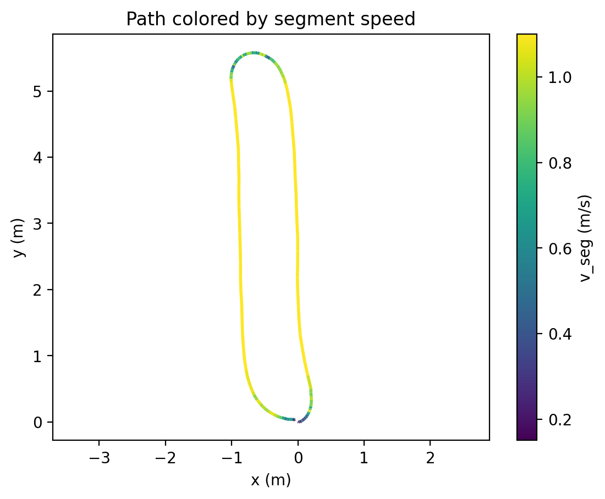
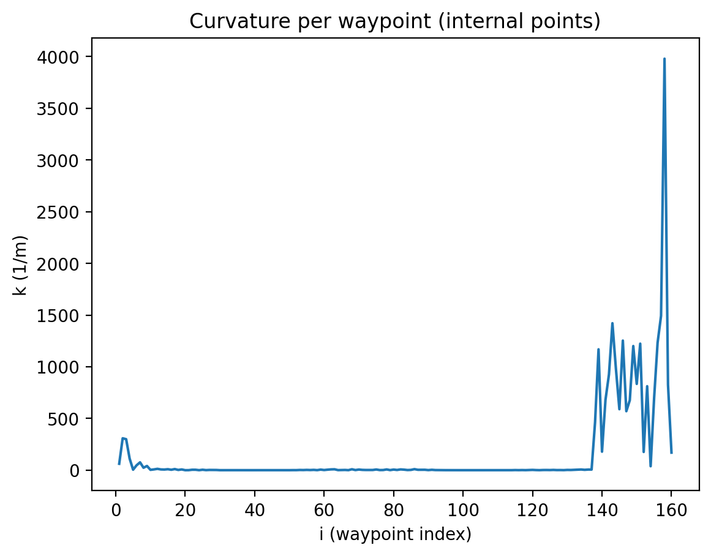
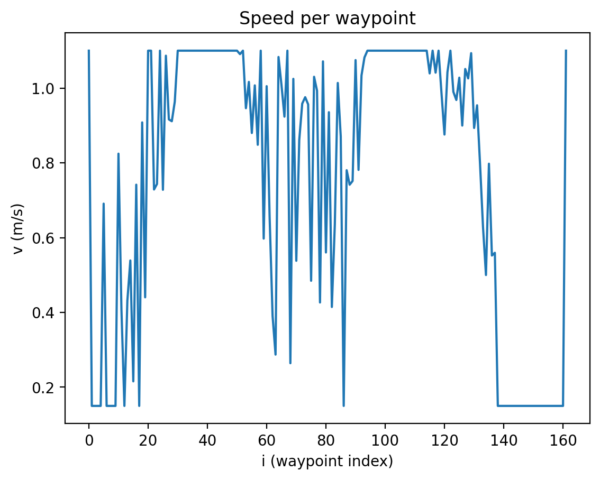
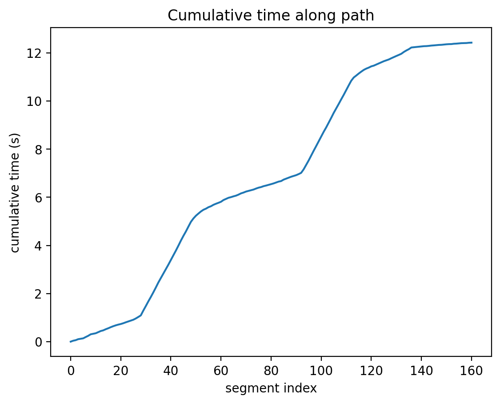

# Robot Path Analysis

This project implements a C++ program that analyzes a robot trajectory from a JSON input file and computes several metrics.

The program calculates:

- Total path length
- Cleaned area covered by the cleaning gadget (without counting overlaps twice)
- Total traversal time based on a curvature-dependent speed model

Additionally, the results are visualized using Python.

---

# Input Data

The program expects a JSON file with the following structure:

```json
{
  "robot": [
    [x0, y0],
    [x1, y1],
    [x2, y2],
    [x3, y3]
  ],
  "cleaning_gadget": [
    [x0, y0],
    [x1, y1]
  ],
  "path": [
    [x0, y0],
    [x1, y1],
    ...
    [xN, yN]
  ]
}
```

---
# Data Description

- **robot:** Polygon representing the robot footprint.
- **cleaning_gadget:** Line segment describing the width of the cleaning tool in the robot coordinate frame.
- **path:** List of waypoints representing the recorded robot trajectory in meters.

---
# Computations
## 1. Path Length

The path length is computed as the sum of Euclidean distances between consecutive points.

```
𝐿 = ∑ sqrt((𝑥𝑖+1 −𝑥𝑖)²+(𝑦𝑖+1 − 𝑦𝑖)²)
```
Where:

**L** = total path length in meters</br>
**x[i], y[i]** = coordinates of waypoint i</br>
**x[i+1], y[i+1]** = coordinates of the next waypoint</br>
**i** = waypoint index along the path

This formula computes the Euclidean distance between consecutive waypoints and sums all segment lengths.
​
## 2. Curvature Estimation

The curvature is approximated using three consecutive points.

For points:
```
A = path[i-1]
B = path[i]
C = path[i+1]
```
Where:

**A, B, C** = three consecutive waypoints</br>
**B** = the point where curvature is evaluated</br>
**i** = waypoint index

These three points form a triangle that is used to approximate the local curvature of the path.

Curvature is then approximated as:
```
𝑘= 4 * 𝐴 / (𝑎 * 𝑏 * 𝑐)
```
​
Where:

**k** curvature at waypoint i
**A** is the triangle area</br>
**a, b, c** are the triangle side lengths

For the first and last point the curvature is set to zero because three points are required.

## 3. Speed Model

The robot speed depends on the curvature.

Parameters:
```
kcrit = 0.5 1/m
kmax  = 10 1/m
vmax  = 1.1 m/s
vmin  = 0.15 m/s
```
Where:

**kcrit** = curvature threshold where speed reduction starts</br>
**kmax** = curvature where minimum speed is reached</br>
**vmax** = maximum robot speed</br>
**vmin** = minimum robot speed

Speed function:
```
v(k) = vmax                                  if k < kcrit
v(k) = vmax - (vmax-vmin)/(kmax-kcrit)*(k-kcrit)   if kcrit ≤ k < kmax
v(k) = vmin                                  if k ≥ kmax
```

Where:

**v(k)** = robot speed as a function of curvature</br>

This model slows the robot down when the path curvature increases.

## 4. Traversal Time

Traversal time is computed per path segment.

For segment i:
```
ds = distance(path[i], path[i+1])
vseg = (v[i] + v[i+1]) / 2
dt = ds / vseg
```
Where:

**ds** = distance of segment i</br>
**v[i]** = robot speed at waypoint i</br>
**v[i+1]** = robot speed at the next waypoint</br>
**vseg** = average speed over the segment</br>
**dt** = time required to traverse the segment

Total time:
```
𝑇=∑ 𝑑𝑠/𝑣𝑠𝑒𝑔
```
Where:

**T** = total traversal time of the robot

Using the average speed provides a smoother approximation of the robot motion.

## 5. Cleaning Gadget Width

The cleaning width is computed as the Euclidean distance between these two points:
```
gadgetWidth = sqrt((x1 - x0)² + (y1 - y0)²)
```

Where:

**x0, y0** = coordinates of the first gadget point</br>
**x1, y1** = coordinates of the second gadget point</br>
**gadgetWidth** = width of the cleaning tool

## 6. Cleaned Area

The cleaned area is approximated using a grid-based occupancy approach.

Steps:

A grid with resolution cellSize = 0.01 m is created.

The robot path is sampled along each segment.

At each sampled point a circular cleaning footprint with radius r is marked on the grid.

```
r = gadgetWidth / 2
```
Where:

r = radius of the cleaning footprint

gadgetWidth = width of the cleaning gadget

Each grid cell is stored in a hash set to avoid duplicates.

The final area is computed as:
```
area = number_of_cells * cellSize²
```

This ensures that overlapping regions are counted only once.

---

# Visualization

Visualization is performed in Python using matplotlib.

The following plots are generated:

**Robot path colored by speed**



**Curvature profile**



**Speed profile**



**Cumulative traversal time**



These plots help understand how curvature influences the robot velocity.

The plots are generated from the CSV file exported by the C++ program using Python and matplotlib.

--- 

# Requirements:

- CMake
- C++20 compatible compiler (GCC / Clang / MSVC)

*Build:*
```
cmake -S . -B build
cmake --build build
```

*Run the program:*
```
./build/robot_path_project data/short.json
```

---

# Tests

Unit tests are implemented using CTest.

Run tests with:
```
ctest --test-dir build
```

*Project Structure*

```
include/
  robot/
    geometry.hpp
    curvature.hpp
    speed_profile.hpp
    time_estimator.hpp
    area.hpp
	json_loader.hpp
	types.hpp
	export.hpp

src/
    geometry.cpp
    curvature.cpp
    speed_profile.cpp
    time_estimator.cpp
    area.cpp
    json_loader.cpp
    main.cpp
    export.cpp

tests/
    test_geometry.cpp
    test_curvature.cpp
    test_speed.cpp
    test_time.cpp
    test_area.cpp
```

# Results (Example)

Example output:

```
Path points: 162
Gadget width: 0.66 m
Total path length: 12.1381 m
Approx cleaned area: 8.1517 m^2
Total time: 12.4248 s
Grid cell size: 0.01 m
```

---
# Notes

The curvature estimation and area computation rely on simplified approximations suitable for recorded robot trajectories.

---
